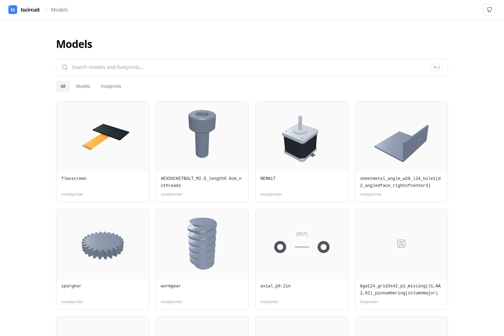
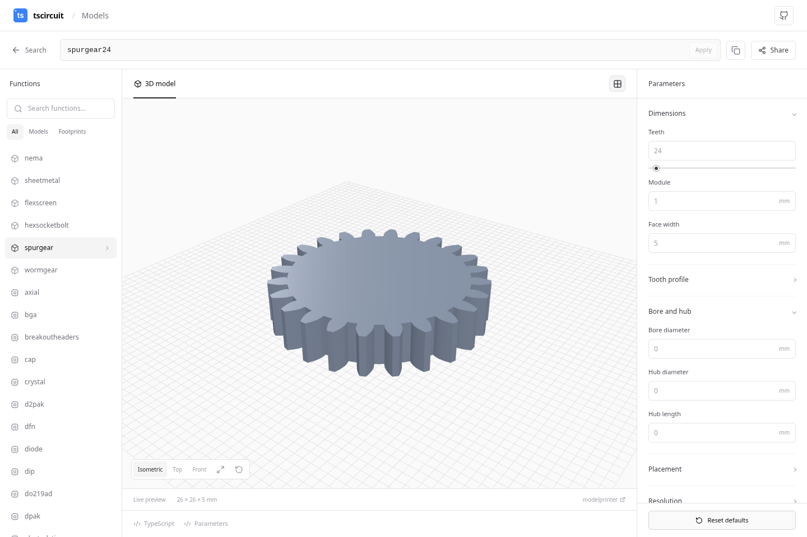

# models.tscircuit.com

An interactive workbench for [ModelPrinter](https://github.com/tscircuit/modelprinter) and [Footprinter](https://github.com/tscircuit/footprinter). Search examples from the libraries' tests, open a model string, and edit its parameters with a realtime preview.



- Seven ModelPrinter functions: NEMA motors, sheet metal, flexible screens, socket bolts, spur gears, helical gears, and worm screws.
- All functions from the installed Footprinter version, with controls generated from the native parameter schemas.
- 3D orbit, pan, zoom, camera presets, and fit; footprint SVG previews with pan and zoom.
- Editable model strings, generated TypeScript, parameter JSON, and shareable configuration URLs.
- Download the current 3D model as GLB, STEP, or Parasolid (`.x_t`) from each configuration page. GLB uses Y-up meters; STEP preserves millimeters and exports the preview's faceted geometry, including available footprint bodies and copper. Parasolid uses `tscircuit/jscad-to-parasolid` to export the full-precision JSCAD solids with the current parameters and placement, in Z-up meters. It preserves separate bodies as faceted solids; colors, analytic curves, and feature history are not included. Unsupported or invalid solids display an export error.
- Responsive catalog and parameter panels, keyboard search with Ctrl/Cmd+K, and validation that preserves the last valid preview.



## Development

Install [Bun](https://bun.sh), then run:

```sh
bun install --frozen-lockfile
bun run dev
```

Open the URL printed by Vite. Geometry generation runs in a Web Worker; edits are debounced and superseded jobs are cancelled.

```sh
bun run test       # Catalog, parameter serialization, and real geometry checks
bun run build      # Regenerate catalogs, typecheck, and bundle
bunx playwright install chromium
bun run test:browser
```

To test a production build, stop the dev server and run `PLAYWRIGHT_PREVIEW=1 bun run test:browser` after building. Set `CHROMIUM_PATH` to use an existing Chromium installation, or `PLAYWRIGHT_BASE_URL` to test an already running server.

## Parameter and preview accuracy

The controls use ModelPrinter's exported Zod schemas and generated metadata from Footprinter's native schemas. The generator filters duplicate aliases, fixed values, and inherited fields ignored by the selected function. Inputs remain separate from resolved defaults so changing a package preset can recompute dependent dimensions. The preview uses the libraries' actual generated geometry and Circuit JSON.

Some Footprinter booleans and enum combinations cannot be expressed by its string grammar. In those cases, the TypeScript tab exports the complete configuration and the UI explains the string limitation. Unsupported or mismatched package bodies are omitted from 3D previews; the exact copper and footprint SVG remain available.

FlexScreen placement objects are edited as JSON and exported as JSX when needed. `wormgear` currently generates a worm screw; a conjugate mating worm wheel is outside the current ModelPrinter implementation.

## Updating the catalogs

Both `dev` and `build` run `generate:catalog`. A clean checkout downloads the pinned public source commits matching the installed npm versions; subsequent runs reuse the immutable source cache in `node_modules/.cache/tscircuit-sources` and scan the tests again.

```sh
bun run generate:catalog
```

`scripts/generate-footprint-catalog.ts` derives Footprinter controls from its Zod schemas. `scripts/generate-model-examples.ts` statically scans all upstream test files for literal strings, finite template expressions, and shared fixtures, without executing test code. It validates candidates with the installed libraries, excludes invalid examples and ignored tokens, and records source files and line numbers. The generated catalog records the package versions, source commits, and test-file counts used for each update.

When upgrading either package, update its version and `scripts/source-pins.json` together, regenerate the catalogs, and run the tests. Catalog tests cover all installed ModelPrinter and Footprinter functions, including functions without a valid test-string example. `FOOTPRINTER_SOURCE_PATH` can override the Footprinter checkout while developing its schemas.

## Cloudflare deployment and model URLs

The Cloudflare Worker serves the Vite site and generates direct downloads using the same geometry and exporters as the configurator:

- `https://models.tscircuit.com/spurgear20_m0.5mm_w3mm_bore2mm` opens that model.
- Append `.glb`, `.step`, or `.x_t` to download the model directly.
- Footprinter strings also work. URL-encode strings containing `#`, `/`, or other reserved characters.
- Existing query-based share links remain supported. Share links use model paths and retain explicit `params` overrides so JSON-only placement and footprint settings survive reloads. These overrides can also be appended to download URLs.

Successful exports are stored as binary KV values with `expirationTtl: 604800` (seven days). Keys include format, resolved parameters, library identity, and bundled library versions. Cache hits do not extend expiration. Invalid requests and export errors are never cached. Files above KV's 25 MiB value limit are served without KV caching. `X-Model-Cache` reports `HIT`, `MISS`, or `BYPASS`. The current site does not use ModelCDN; no existing ModelCDN integration is replaced.

```sh
bunx wrangler login
bunx wrangler kv namespace create MODEL_CACHE
# Put the returned namespace id in wrangler.jsonc.
bun run deploy
```

Select the `tscircuit` Cloudflare account when prompted. The custom-domain route in `wrangler.jsonc` assigns `models.tscircuit.com` to this Worker. If an existing DNS record points to Vercel, remove that record before assigning the Worker custom domain. The Worker includes static assets and SPA fallback; model extensions run through the Worker first. The configured CPU budget requires Workers Paid for complex CAD exports.

For local end-to-end tests, run `bun run dev:worker`. This uses local KV and serves model URLs from the actual Workers runtime. `bun run dev` remains the browser-only configurator development server.

GitHub Actions deployment requires repository secrets `CLOUDFLARE_API_TOKEN` (Workers Scripts Edit, Workers KV Storage Edit, account access and the domain permissions needed for custom domains) and `CLOUDFLARE_ACCOUNT_ID`, plus the committed KV namespace id. The deploy workflow follows successful validation on main, including scheduled library updates. Set up those secrets before enabling automatic deployment. The previous Vercel deployment can remain available during migration.

## Daily library updates

The `Update model libraries` GitHub Actions workflow checks npm daily at 10:23 UTC and can also be run manually from the Actions tab. It checks `@tscircuit/footprinter`, `@tscircuit/modelprinter`, and `jscad-electronics` for newer stable releases.

When versions change, it updates exact package pins, the Bun lockfile, and the matching published Git commits in `scripts/source-pins.json`. It regenerates the catalogs and runs the production build, unit tests, and browser tests before committing to `main`. The Cloudflare deploy workflow deploys that validated commit once its repository secrets are configured. Unchanged versions produce no commit or deployment; failed validation leaves production unchanged. No additional deployment secret is needed. If branch protection is added later, it must allow this workflow's updates or the publishing step will fail.

Run `bun run update:libraries` locally to update the package/source pins and install dependencies, then run `bun run build`, `bun run test`, and `PLAYWRIGHT_PREVIEW=1 bun run test:browser` before committing the generated catalogs.
